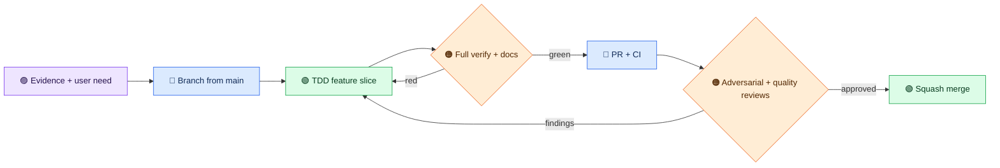

# Development workflow

[The agent contributor guide](AGENTS.md) is the authoritative PR process. This page explains the cadence for the 2.0 line and replaces the older staging-first, shared-worker-file workflow.



Start each slice with the user outcome, a failing test when behavior changes, and a concise threat/performance note. Implement the smallest coherent change, update the quickstart and architecture when contracts change, run focused tests, then `./mvnw -B verify --no-transfer-progress`. Check generated artifacts, not only source. For HTTP changes, run a packaged-jar smoke test. For protocol changes, run both transports and record the negotiated version.

Before a PR, run a local adversarial pass covering traversal, symlinks, unknown scopes, malformed JSON, oversized input, private canaries, and prompt injection in build output. Run `./scripts/docker-verify.sh` for a disposable offline clean-room build when the Docker image and local Maven cache are available. The container uses a read-only cache and no network, socket, or host secret mounts.

Open a PR targeting `main` and wait for CI. Two independent reviewers each use a fresh exact-head checkout, run focused tests for changed paths, inspect the independent full CI verify, and run a local full verify when risk warrants it: one focuses on adversarial security and correctness, the other on code quality, SOLID boundaries, performance, tests, and docs. They leave inline findings when needed and role-tagged verdicts in the GitHub PR. Address every thread and rerun gates. Merge only when CI and both verdicts are green. A release candidate adds protocol conformance, privacy canary, container smoke, strict docs build, migration guide, version consistency checks, and the [keyless dependency alert audit](DEPENDENCY_MANAGEMENT.md#12-final-release-gate-open-dependabot-alerts) on the final default-branch commit.

Never paste private user data, credentials, home paths, or raw build output into issues, PRs, CI logs, tests, or model prompts. Use synthetic `.invalid` examples and report counts/status rather than values.

## Keep the review loop short without weakening its gates

Work in one narrow, reviewable behavior slice per PR. Assign separate worktrees to independent engineers so feature changes do not collide. Start with a focused failing test or a measured baseline; run focused tests during implementation, then one full `./mvnw -B verify --no-transfer-progress` on the completed commit before push. For build-result changes, inventory per-stream, combined raw, JSON escaping, policy input, and model-output bounds; test each boundary with synthetic canaries before requesting final-head reviews. Run strict docs and both privacy scans (`--base HEAD` and `--tracked`) when their inputs change. The scanner is a heuristic gate, so review changed data flows as well. Repeat a full local or Docker verify only after a relevant code change or unresolved failure; CI provides its own independent run. The Docker clean-room verify reuses the host's **repository artifacts** read-only through `scripts/docker-verify.sh`, while a committed tracked-file archive is extracted into disposable container storage. Commit source changes before running it. Do not mount the entire home directory, Maven settings, credentials, or the Docker socket.

Privacy findings print an opaque `file:<ref>:<line>` rather than a filename. A human maintainer can resolve one reference in an interactive local terminal with `python3 scripts/check-public-data.py --resolve-ref <ref>`; the path is JSON-escaped. The command refuses CI and noninteractive output. Do not paste the resolved path into an agent, issue, or PR.

Open the draft PR as soon as the coherent slice is ready. CI can run while two reviewers inspect a **fixed commit SHA** in fresh checkouts. They test the changed paths, check full CI evidence, and post role-tagged verdicts to the PR. If a review finds a defect, fix it, answer the inline thread, let CI rerun, and have both reviewers reconfirm the new head; do not keep polling or restarting reviewers against a moving branch. Check the four gates in `AGENTS.md` once, then merge. This preserves the adversarial and code-quality review requirement without multiplying full builds on an unchanged commit.

For protocol work, install a pinned conformance runner once and reuse its package cache; record the runner version and applicable scenarios. A broad optional-capability suite may report failures for capabilities this server does not advertise, so classify those separately from failures of applicable requirements. Neither a successful bespoke smoke test nor a green unit test replaces applicable official conformance.

## Reproducible performance baseline

Build the packaged jar, then run `python3 scripts/benchmark-release-gate.py --runs 5 --warmups 2 --output benchmark.json` on a host with Maven, Gradle, and sbt installed. The script creates dependency-free disposable projects, calls the packaged server over stdio, and measures end-to-end `list_build_tools` callback latency, **fresh source-compilation** latency, 100 ms sampled process-tree RSS, MCP response bytes, and a synthetic 1 MiB versus 24 MiB unterminated-output stress case. Before every build call, it changes a Java constant and removes the generated class; afterward it requires the compiled class hash to change. This keeps dependency caches warm while excluding up-to-date/no-op compilation samples. The output wrapper records the number of stdout bytes after flushing, and the harness verifies that count before reporting bounded-output evidence. It does not emit raw MCP responses, build logs, project paths, or process command lines. The output-stress case uses a disposable Gradle-named wrapper; its numbers test capture behavior, **not Gradle compilation**.

Record OS, architecture, Java and build-tool versions, core/memory limits, warmup and sample counts, network mode, and whether each cache was cold or warm with the aggregate result. Compare measurements only within the same environment and cache state. A 100 ms RSS sample can miss short peaks; process-tree RSS sums resident pages across processes and is not a JVM heap measurement. Five runs are enough to expose obvious regressions, not to prove a universal p95 service-level objective. Set thresholds only after repeated baselines on the intended CI runner; investigate noise before treating a slower run as a regression.

For a clean-room run, build the existing server image once. `scripts/benchmark-docker.sh` builds a small Python/procps layer and stages **only** the packaged jar and benchmark script read-only. Networked bootstrap sees only dedicated writable Docker volumes for public Maven, Gradle, and sbt artifacts; it never mounts the host Maven repository. Discard the bootstrap numbers. The second command is the measured, offline pass using those same warmed volumes:

```sh
./mvnw -B package -DskipTests --no-transfer-progress
docker build -t jvm-build-tools:2.0-local .
BENCHMARK_CACHE_STATE=cold sh scripts/benchmark-docker.sh bootstrap --runs 1 --warmups 0 > /tmp/benchmark-bootstrap.json
BENCHMARK_CACHE_STATE=warm sh scripts/benchmark-docker.sh offline --runs 5 --warmups 2 > /tmp/benchmark-offline.json
```

The script runs as a nonroot UID with a read-only root filesystem, a tmpfs for generated projects, CPU/memory limits, no host secrets, and no Docker socket. To reuse an existing host `.m2` repository, set `BENCHMARK_OFFLINE_MAVEN_REPOSITORY` to that artifact directory **only for the offline command**; it is mounted read-only and is never visible to a networked bootstrap. Otherwise the dedicated Maven volume avoids repeated downloads. Gradle/sbt runtime caches remain writable. If an offline case needs a missing public artifact, repeat the bootstrap and record that cache change. Never label the network-bootstrap result an offline baseline. The `/tmp` JSON files contain aggregate metrics only; inspect them before publishing. On an existing warmed volume, mark the bootstrap cache state `warm` rather than `cold`.

An offline Docker run on the **release-candidate source tree** used candidate PR head `596a88370ba872d5d5c3abaff34e882aec9137d4`; its source tree matches merged main `e1cb0d1966e0ee11815b2b4732b879968dd34adb`. The environment was Linux/aarch64, Java 21.0.12.1, three CPU cores, a 4 GiB memory limit, network disabled for measured runs, and warm dedicated public-artifact volumes. It used two warmups and five measured runs per case. The Maven, Gradle, and sbt samples recompiled changed Java classes and verified distinct class fingerprints. Both synthetic output cases verified the emitted byte counts. Results below are end-to-end packaged-server stdio calls; p95 is directional with only five samples, and 100 ms RSS sampling can miss short peaks.

| Synthetic case | p50 latency (ms) | p95 latency (ms) | p95 sampled process-tree RSS (MiB) | Max MCP response (bytes) |
| --- | ---: | ---: | ---: | ---: |
| `list_build_tools` callback | 1.44 | 2.38 | 195.88 | 152 |
| Maven `compile` | 898.37 | 909.64 | 364.58 | 304 |
| Gradle `compileJava` | 2294.08 | 2325.28 | 684.33 | 128 |
| sbt `compile` | 7655.69 | 7801.43 | 561.86 | 152 |
| Synthetic 1 MiB output | 24.98 | 28.56 | 205.23 | 152 |
| Synthetic 24 MiB output | 32.83 | 33.16 | 215.46 | 152 |

The response sizes stayed bounded in both stress cases despite the larger process output. These figures are evidence for this source tree and environment, not a latency budget or a regression claim. Repeat on a pinned CI runner and matched cache state before setting thresholds. The previous three-sample exploratory run is preserved in Git history for comparison, but its setup and sample count differ.

The [2.0 release gates](reference/release-gates.md) record the exact packaged-server protocol checks, adversarial probes, and remaining security-scan prerequisite.
