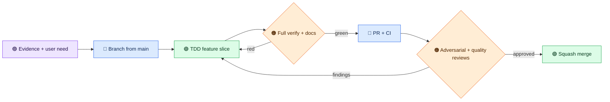

# Development workflow

[The agent contributor guide](AGENTS.md) is the authoritative PR process. This page explains the cadence for the 2.0 line and replaces the older staging-first, shared-worker-file workflow.

Start each slice with the user outcome, a failing test when behavior changes, and a concise threat/performance note. Implement the smallest coherent change, update the quickstart and architecture when contracts change, run focused tests, then `./mvnw -B verify --no-transfer-progress`. Check generated artifacts, not only source. For HTTP changes, run a packaged-jar smoke test. For protocol changes, run both transports and record the negotiated version.

Before a PR, run a local adversarial pass covering traversal, symlinks, unknown scopes, malformed JSON, oversized input, private canaries, and prompt injection in build output. Run `./scripts/docker-verify.sh` for a disposable offline clean-room build when the Docker image and local Maven cache are available. The container uses a read-only cache and no network, socket, or host secret mounts.

Open a PR targeting `main` and wait for CI. Two independent reviewers each use a fresh checkout and run full verify: one focuses on adversarial security and correctness, the other on code quality, SOLID boundaries, performance, tests, and docs. They leave inline findings and role-tagged verdicts in the GitHub PR. Address every thread and rerun gates. Merge only when CI and both verdicts are green. A release candidate adds protocol conformance, privacy canary, container smoke, strict docs build, migration guide, and version consistency checks.

Never paste private user data, credentials, home paths, or raw build output into issues, PRs, CI logs, tests, or model prompts. Use synthetic `.invalid` examples and report counts/status rather than values.
