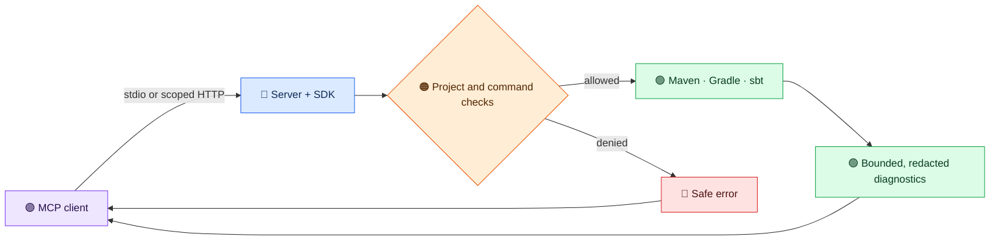

# JVM Build Tools MCP Server

Run and inspect Maven, Gradle, and sbt builds through one Model Context Protocol server. The 2.0 release candidate exposes **24 public tools** over local stdio or optional Streamable HTTP.

[Download the published v2.0.0-rc.1 JAR](https://github.com/thepragmatik/mcp-server-jvm-build-tools/releases/download/v2.0.0-rc.1/mcp-server-jvm-build-tools.jar) or read its [release notes](https://github.com/thepragmatik/mcp-server-jvm-build-tools/releases/tag/v2.0.0-rc.1). The structured-result feature described in the [post-RC1 reference](reference/structured-build-results.md) is a later development increment and is not part of the RC1 download.

-   :material-rocket-launch: **Start a build**

    Follow the [2.0 quickstart](user-guide/quickstart-v2.md) to set a project root, launch the packaged JAR, and detect your first build tool.

-   :material-shield-lock: **Keep results private**

    Read the [configuration guide](user-guide/configuration.md) for project boundaries, HTTP scopes, and bounded, redacted diagnostics.

-   :material-file-swap: **Upgrade from 1.x**

    Check the [migration guide](user-guide/migration-v2.md) before changing an existing client or automation.

-   :material-sitemap: **Understand the design**

    Browse the [architecture](reference/architecture.md), [current tool catalog](reference/tool-catalog.md), and [release gates](reference/release-gates.md).

**Build scripts still run with the server process's operating-system permissions.** A configured project root limits accepted paths; it does not sandbox untrusted code. See [container isolation](reference/design-v2.md#container-isolation) for a stronger boundary. The server keeps raw build logs and commands local; model-visible results contain bounded, redacted diagnostics. A client or user can still send private text in a prompt, so review what you share.

Looking for implementation details? Start with the [2.0 design review](reference/design-v2.md) and [developer workflow](WORKFLOW.md). Older 1.x examples and specs are labeled as historical reference.
