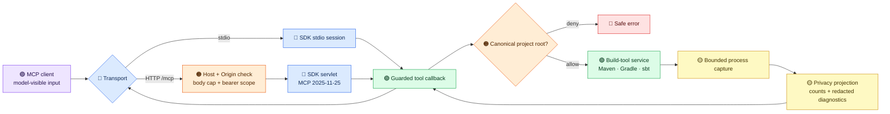
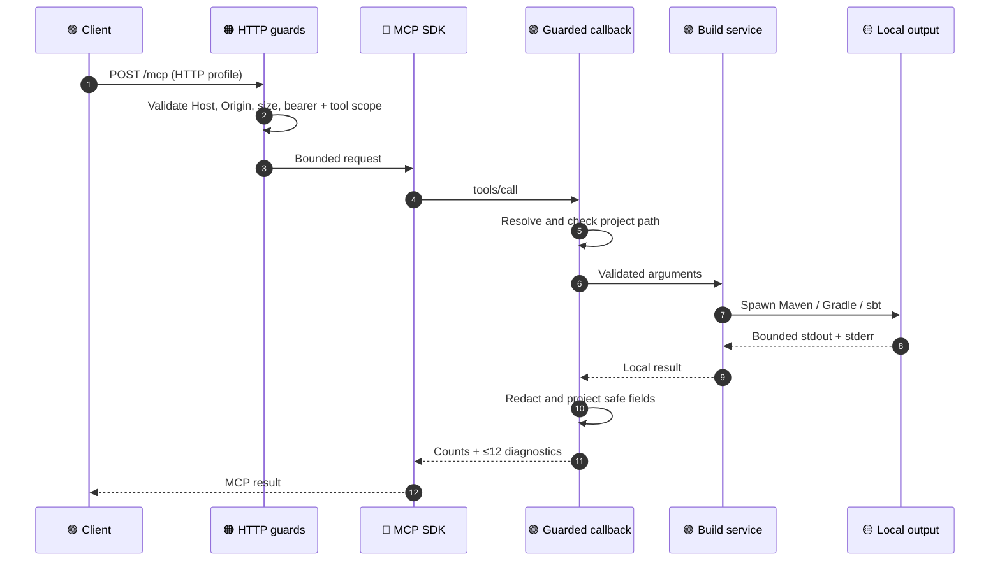

# Architecture

This page describes the **2.0 release-candidate design**. The supported
Java SDK speaks MCP `2025-11-25` over stdio or stateless Streamable HTTP.
The public [runtime-derived catalog](tool-catalog.md) contains 24 tools.
The 1.x tool list and 2026 draft protocol notes are historical records,
not this server's current wire contract.

## Trust boundaries

The purple side is outside the server's control: a client may send prompts
and arguments to a model provider before MCP sees them. Relative
`projectDir` aliases avoid placing absolute host paths in routine tool
calls. The orange checks guard the server boundary; the yellow stages
bound and redact results before they return to the model. A project root
restricts paths but does **not** sandbox build scripts. Run untrusted
workspaces with OS or container isolation, minimal mounts, and restricted
network access.

## Core components

| Layer | Active implementation | Responsibility |
|-------|-----------------------|----------------|
| Application wiring | `BuildToolsApplication` | Registers the annotated tool service beans once. |
| Tool catalog | `MethodToolCallbackProvider` → `DeterministicToolCallbackProvider` → `GuardedToolCallbackProvider` | Discovers tools, sorts names, limits the public surface to known permissions, substitutes safe descriptions, validates path arguments, and applies output projection. |
| Project boundary | `ProjectAccessPolicy` | Resolves existing paths with `toRealPath()` against configured allowed roots; ambiguous or markerless build-tool detection requires an explicit choice. |
| Build-tool selection | `BuildToolProvider` and `BuildTool` implementations | Selects Maven, Gradle, or sbt and delegates execution or analysis. |
| Process lifetime | `SyncProcessRunner`, `BoundedProcessOutput`, and async build handling | Drains stdout and stderr concurrently, retains bounded head/tail bytes, applies timeouts, and terminates descendants on timeout or cancellation. |
| Result boundary | `ModelOutputPolicy` and `PrivacySafeMcpJsonMapper` | Selects safe fields and normalized diagnostics for tool results; replaces caller-derived JSON-RPC error detail with generic text on both transports. |
| HTTP transport | `HttpMcpServerConfiguration` and servlet filters | Exposes `/mcp` through the SDK's stateless servlet when the `http` profile is active. |
| Stdio transport | `McpServerTransportConfiguration` | Keeps stdout reserved for SDK JSON-RPC and serves the same guarded callbacks. |

The callback provider is the public catalog's source of truth. It currently
serves 24 sorted tools; `ToolScopeCoverageTest` compares the committed
[tool catalog](tool-catalog.md) with those runtime callbacks and their
`ToolPermission` scopes. Adding a method annotation alone does not make a
tool safe or public.

## Request flow

For stdio, the SDK session replaces the HTTP guard stage. The same
callback and output policy still run, but there is no HTTP bearer filter;
local process access and the allowed project roots are the primary
boundaries. A supplementary build-events SSE feed is not the MCP
Streamable HTTP transport. The experimental 2026 `server/discover`
handler is disabled in the supported profile; clients should negotiate
with `initialize` and enumerate tools with `tools/list`.

### HTTP guard order

`McpOriginHostFilter` runs first (`@Order(0)`) and rejects untrusted
Origin and loopback Host values. `OAuthResourceServerFilter` (`@Order(1)`)
requires a configured bearer key in the HTTP profile and checks the
requested tool's scope. `McpHeaderValidationFilter` (`@Order(2)`) applies
the 1 MiB request-body cap and validates optional MCP routing headers.
The SDK servlet then handles the JSON-RPC request. Invalid Origin and
Host requests receive 403 before reaching a tool. HTTP scope checks do
not depend on the older `buildtools.auth.enabled` switch.

## Privacy and performance budgets

| Boundary | Current limit | Effect |
|----------|---------------|--------|
| MCP HTTP POST body | 1 MiB by default | Oversized requests receive 413 before SDK dispatch. |
| Process stdout and stderr | 32 KiB head + 96 KiB tail **per stream** | Readers keep draining large or unterminated output without retaining whole logs. |
| Tool-result projection input | final 256,000 characters | The projector never parses an unbounded returned string. |
| Model-visible diagnostics | at most 12; messages at most 500 characters | Includes severity, category, and per-result references; raw logs, commands, file paths, and symbols remain local. |

These are retained-data limits, not a CPU, memory, disk, network, or
subprocess sandbox. Redaction is strongest for recognized diagnostics;
arbitrary text can contain private information that patterns cannot
prove absent. Keep raw logs local and use synthetic privacy canaries in
tests. The [release gates](release-gates.md) measure real workloads
instead of inferring latency improvements from source inspection.

## Architecture review findings

| Finding | Evidence and consequence | Release treatment |
|---------|--------------------------|-------------------|
| A current tool can lose useful projected output | Dogfood found an empty `list_build_tools` result through `ModelOutputPolicy`. A separate fix and end-to-end retest are required. | **Release blocker** until the fix is merged and both transports pass final dogfood. |
| Cross-tool result projection is highly coupled | `ModelOutputPolicy` interprets tool-specific JSON and plain text centrally. Adding a tool requires synchronized changes to its projection, metadata, permissions, and docs; silent field loss is possible. | After the candidate, split projections into typed, per-tool contracts with characterization tests. |
| Construction and selection are coupled to concrete classes | `BuildToolsService` and `DependencyService` construct parser/resolver implementations, while `BuildToolProvider` constructs build-tool instances. This makes substitutions and focused tests harder. | Roadmap refactor: inject interfaces or factories and preserve behavior with contract tests. |
| Filesystem checks cannot prevent all races | A symlink or build file can change after canonical validation and before a child process opens it. Build scripts can execute arbitrary project code. | Document the limitation now; require external isolation for untrusted projects. |

These findings are based on the current code and synthetic dogfood.
They are not claims that a broader refactor has already shipped. The
[2.0 design review](design-v2.md) records the security decisions and
[roadmap](../ROADMAP.md) tracks release evidence and follow-up work.

## Extending the server

1. Add a focused `@Tool` method to the appropriate service and register
   that service in `BuildToolsApplication` if it is new.
2. Assign exactly one public scope in `ToolPermission`. Add a safe public
   description and an explicit output projection; unknown private fields
   must not pass through by default.
3. Test the input schema, project-root behavior, authorization, redaction,
   and bounded errors with synthetic data.
4. Regenerate the runtime [tool catalog](tool-catalog.md), run
   `./mvnw -B verify --no-transfer-progress`, strict docs, and the
   privacy scan. Follow the [agent PR workflow](../AGENTS.md) for two
   independent reviews.

The Java baseline is 21. The candidate uses Spring Boot 4.1.1,
Spring AI 2.0.1, and the MCP Java SDK 2.0.1. The Maven wrapper,
container verification, JDK matrix, and packaged protocol gates are
described in the [release guide](release-gates.md).
