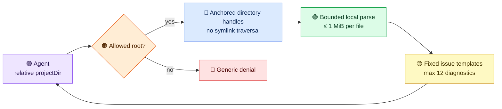

# Configuration validation in 2.0

Call `validate_build_configuration` with a project path under a configured allowed root. It reads supported build files without running a build. A typical agent call uses a root-relative path:

```json
{"projectDir":"service-a"}
```

For a Maven project missing its artifact ID, the model-visible result has this shape:

```json
{
  "completed": true,
  "valid": false,
  "tool": "maven",
  "issueCount": 1,
  "diagnostics": [{
    "severity": "error",
    "category": "configuration",
    "message": "Required POM artifactId is missing.",
    "diagnosticRef": "d1"
  }]
}
```

Inspect `pom.xml` locally to make the edit. The result can identify a fixed class of problem but cannot disclose a private coordinate, path, parser error, or source excerpt. Unknown issue text becomes a generic local-inspection diagnostic. At most 12 diagnostics are visible; `issueCount` remains the aggregate, and `diagnosticsTruncated` marks omitted entries.



The Maven validator caps input at 1 MiB before parsing. It rejects malformed XML, DTDs, and external entities; disables XInclude and external DTD/schema access; and checks direct `<project>` coordinates, inherited parent coordinates, duplicate direct dependencies, and inconsistent plugin versions. These controls follow the [Oracle JAXP security guidance](https://docs.oracle.com/en/java/javase/25/security/java-api-xml-processing-jaxp-security-guide.html). A POM above the limit gets a fixed error, including when it would otherwise be valid. This is structural validation, not Maven model resolution or a complete schema check; run Maven locally to validate interpolation, profiles, and plugins.

Maven and Gradle validation keep the canonical path checked by the access guard unchanged, then open each path component relative to a held directory handle, starting at the filesystem root, and do not follow symlinks. This prevents a concurrent replacement of the project directory or build file from redirecting validation outside the allowed root. Build-file symlinks are rejected even when they point inside that root. The local filesystem/JDK must support Java `SecureDirectoryStream`; otherwise validation fails closed with a fixed “race-free validation unavailable” diagnostic. The [official Java API](https://docs.oracle.com/en/java/javase/21/docs/api/java.base/java/nio/file/SecureDirectoryStream.html) describes that provider-dependent support. The Docker image uses a Java 21 Noble base whose support is checked during image construction. Other MCP tools still have separate filesystem access paths; use an isolated, trusted project mount for untrusted builds.

Gradle `.gradle` and `.gradle.kts` reads are also capped at 1 MiB; their checks remain lightweight syntax heuristics. They now use the same finite model-visible issue projection, while the original local issue detail stays private. sbt configuration validation is not implemented. The packaged [release gate](release-gates.md) probes Maven validation over HTTP and stdio with synthetic malformed XML, external entities, oversized input, parent inheritance, and private canaries.
