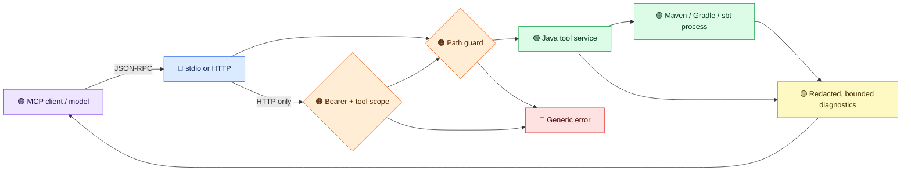
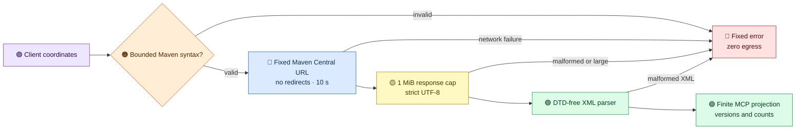
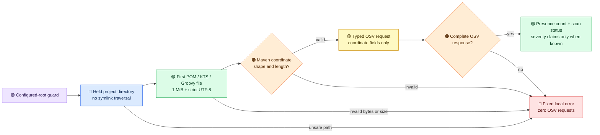
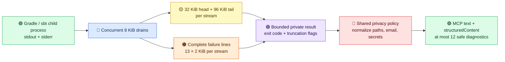

# Design review for 2.0

This page records the architecture decision for the 2.0 development line. The published first prerelease is `v2.0.0-rc.1`; `main` now builds the unreleased `2.0.0-rc.2` development candidate. Required project roots, default HTTP authentication, removed model-visible tools, narrowed result shape, and scope semantics break 1.x clients. A later release tag requires all gates to pass on its exact commit.

## Trust boundaries

The `ToolCallbackProvider` is the shared boundary for stdio and HTTP. Only tools explicitly mapped to a public permission are exposed; future `@Tool` methods are private by default. It canonicalizes `projectDir` and `localRepositoryPath`, rejects build files whose real paths escape the configured roots, and applies the output policy. Raw resource readers, URI-template tools, free-form CI generation, and async task tools remain private until they have useful privacy-safe result contracts. Async task summaries written inside a project contain only status, tool, timestamps, and exit code; commands and raw errors are not persisted into a Git repository. HTTP adds bearer and per-tool scope checks before dispatch. The catalog is static, so wrappers and credential digests are cached. Input schema failures abort startup and SDK input validation is enabled.

The public tool descriptions state the result contract after the output policy, rather than the richer local Java return values. In particular:

| Tool | Model-visible result | Retained locally |
|---|---|---|
| `check_dependency_version` | Version and upgrade status; optional `securityStatus`, bounded `cveCount`, and `highestSeverity` | Dependency identity and individual OSV findings |
| `analyze_pom_dependencies` | Dependency, managed-dependency, and imported-BOM counts | Coordinates and per-dependency classifications |
| `scan_dependency_cves` | `scanStatus`, recognized declaration count (`totalDeps`), and affected-dependency presence count (`vulnerableDeps`); `severityUnknown` when OSV omits severity. High/critical counts appear only when all returned severities are known. Failed or partial lookups return `scanStatus: incomplete` and no counts. | Dependency and CVE identities |

These aggregate results support triage but cannot identify a particular dependency to edit. A user who needs that detail must inspect the local build report outside the MCP result channel. The tool metadata and protocol tests pin this contract so a future implementation cannot advertise details that the model never receives.
For `check_dependency_version`, `includeSecurityInfo=true` sends the supplied coordinates and version to OSV.dev. A successful lookup exposes only a bounded aggregate count and known/unknown highest severity; a failed or malformed lookup exposes `securityStatus: incomplete` without a count. An oversized or malformed private version result returns `metadataStatus: incomplete` and an error. Individual advisories, summaries, and package identities stay local. The option has no OSV effect unless `currentVersion` is supplied.

The Maven Central metadata lookup is another explicit egress boundary. It admits bounded Maven coordinate syntax before constructing a fixed-host URL, rejects redirects, imposes a ten-second request deadline and 1 MiB body cap, then parses strict UTF-8 XML with DTD and external-entity access disabled. Errors use fixed text; the shared output policy exposes only safe version and count fields. The optional OSV query is a separate outbound operation.

The [configuration validator](configuration-validation.md) illustrates the same boundary for files: bounded local XML parsing creates local issues, then a finite template projection exposes only fixed configuration diagnostics and the aggregate count. The model receives neither parser exception text nor values read from the POM.
Its build-file reads use `SecureDirectoryStream` to resist path-component replacement races. The central project guard checks its build markers through one held project directory handle where supported. The CVE scan applies a held-directory read across POM, Gradle Kotlin, and Gradle Groovy marker priority, then admits only bounded coordinate-shaped values into typed OSV requests. On providers without secure directory streams, the guard retains canonical-path marker checks, which are not race-free; configuration validation and the CVE scan fail closed. Later tool reads and subprocess paths can still encounter replacements after the guard closes its handle and need a separate audit before stable 2.0.

[OSV.dev](https://google.github.io/osv.dev/post-v1-querybatch/) receives dependency coordinates by design, so operators should treat the scan as an explicit network egress operation. The lexical gate cannot identify a secret deliberately encoded to resemble a valid Maven coordinate. A secure offline XML parser reads only direct `<project><dependencies><dependency>` children, even when `<dependencyManagement>` appears first; it accepts normal Maven namespaces. No project-level dependencies block yields zero recognized declarations. Every direct dependency needs an explicit literal group, artifact, and version; inherited or property-based versions make the scan incomplete before egress. Gradle extraction recognizes literal calls to `implementation`, `api`, `compileOnly`, `runtimeOnly`, `testImplementation`, and `testRuntimeOnly`, skipping comments and quoted code; dynamic arguments or escaped coordinate strings to those calls fail incomplete. Slashy Groovy strings and Kotlin backtick identifiers also fail incomplete until their syntax is supported safely. It does not resolve the transitive graph or other declaration styles. `totalDeps` counts recognized declarations, not all project dependencies. The batch API returns only vulnerability IDs and modification times, so a positive result increments `vulnerableDeps` without asserting that it meets the requested severity threshold. `severityUnknown: true` and `scanStatus: severity_unknown` identify that case; `highCount` and `criticalCount` are omitted. A complete empty response can show zero; unsupported declarations, invalid coordinates, HTTP failures, malformed or oversized responses, pagination, and more than 500 declarations produce a fixed incomplete result without counts. OSV responses are capped at 2 MiB, with a 10-second timeout per request and at most five 100-package batches. A clean result is a limited direct-declaration check, not a full project security audit.

The local scan file read has a five-second deadline and one daemon worker with no queue. A named pipe or other nonregular marker is rejected through the held directory before opening it. Standard Java directory streams do not offer a nonblocking final-file open: a concurrent swap from a regular file to a pipe in the remaining check/open window can occupy that worker until the process restarts. Further scan calls then fail closed rather than accumulating blocked threads. If a private report exceeds the shared 256,000-character projection limit or cannot be parsed, the model receives an explicit incomplete status without counts. Untrusted projects still require OS-level isolation.

Build execution and output analysis return `diagnostics` as structured objects: `severity` (`error` or `warning`), `category` (`compilation`, `test`, `dependency`, `configuration`, `execution`, or `other`), per-result `diagnosticRef`, optional per-result `fileRef`, `fileType` (`java`, `kt`, `scala`, `xml`, `gradle`, `kts`, or `sbt`) and positive `line`, and a redacted message of at most 500 characters. At most 12 distinct source diagnostics are returned, errors first; `diagnosticsTruncated: true` signals omitted entries. Recognized failure phrases retain the cause (for example, `cannot find symbol`) but normalize arbitrary identifiers, values, and dependency coordinates to placeholders. Unknown or suspicious text receives a generic local-inspection message. `diagnosticRef` distinguishes errors whose public fields otherwise match; `fileRef` groups messages from one file within a result but reveals no path. This is a triage contract: the user must inspect local build output to map a reference to a file and symbol before editing. The parser's raw log and command are removed before serialization for the model-visible policy, preserving final structured errors even when the original build output was large. Neither source excerpts nor raw file or symbol identities are emitted.

Built-in Maven, Gradle, and sbt execution now carries the completed process exit code through both build tools. A nonzero exit stays a failure even if the retained log says BUILD SUCCESSFUL. Maven analysis and Gradle/sbt execution and analysis retain a bounded set of complete failure lines from the middle of a large stream. These are private candidates until the shared policy turns recognized causes into redacted diagnostics. The legacy Java execution method and custom plugins retain their existing contracts; a plugin without typed status exposes unknown public status.

## Large-output diagnostic path

The orange lane retains a root cause that would otherwise fall between the yellow head and tail. It never bypasses the red privacy boundary. outputTruncated means bytes were omitted from head/tail storage; diagnosticsTruncated means a candidate might be missing because a line was too long or the candidate count was exceeded. Both streams are bounded separately; the combined result keeps at most 13 distinct candidates before the public 12-diagnostic limit. The final bounded partial line is examined only after its reader reaches EOF. Analysis adds a candidate only when the retained stream edges do not already contain it, so one source error counts once; execution places candidates at the front because private-envelope clipping may drop their original edge occurrence.

## Critical review

| Finding from 1.x | 2.0 decision | Remaining risk |
|---|---|---|
| A built-in development key could authenticate HTTP | Remove it; HTTP defaults to bearer enforcement and keys default to no scopes | Operators must provision a key locally |
| Scope enum omitted live tools and was not enforced on calls | Publish only the 24 explicitly scoped tools; fail CI on catalog drift; check scope on HTTP `tools/call` | stdio relies on local process trust |
| Schema parse failure became an empty schema | Abort startup; validate tool inputs | Schema compatibility needs client conformance tests |
| Arbitrary build output and exceptions could reach the model | Project recognized failures to bounded redacted diagnostics; return generic errors for unknown text | Pattern redaction cannot prove every private identifier was removed |
| A stored build plan could be executed by ID without a path on the call | Withhold `create_build_plan` and `execute_build_plan` from MCP | Plan ownership and cancellation need a later design |
| Tool metadata, docs, and registry disagreed | Generate the 24-tool public catalog from runtime metadata and fail CI on drift | Keep prose and historical pages clearly scoped to their release |
| Project detection could silently fall back to Maven | Treat markerless or ambiguous directories as an explicit error | Hybrid projects must specify a tool name |

A configured root is a filesystem boundary, not a sandbox. The canonical path check prevents common traversal and symlink escape, but a build script can execute programs, reach the network, and mutate files accessible to its process. A hostile workspace therefore needs OS or container isolation. Likewise, client prompts and tool arguments travel through the client/model provider before reaching this server. Relative aliases avoid sending an absolute home path; the server cannot guarantee that a client or user never sends private prompt text.

## Protocol contract

The runtime uses [MCP Java SDK 2.0.1](https://github.com/modelcontextprotocol/java-sdk/blob/main/VERSIONING.md), whose documented spec line is `2025-11-25`. The SDK BOM aligns all resolved MCP modules to 2.0.1. The HTTP profile registers the SDK's stateless servlet on `/mcp`; its packaged-jar smoke and automated integration tests exercise `initialize`, `tools/list`, and `tools/call`. Discovery advertises that revision only. The published 2026-07-28 revision is not yet supported by this Java SDK; an inactive `server/discover` handler remains a compatibility experiment, and `/mcp/discover` is only an informational probe. A servlet filter validates `Origin` on every MCP request before SDK dispatch and rejects untrusted loopback `Host` values, including when bearer authentication is disabled. It caches the configured Origin policy at startup. The official 2025-11-25 DNS rebinding scenario is a release gate; other conformance scenarios and both transports need client coverage before stable release.

## Performance budget

Default Maven Central and OSV HTTP clients are shared per process rather than created for each service instance. This keeps selector-thread growth bounded when tools or tests construct many service objects; request deadlines and response caps still apply per call. The nonroot Docker verification retains its explicit process and memory ceilings as a resource regression gate.

The hot path parses each tool argument once, checks canonical paths, runs the tool, then redacts a bounded result. The output policy limits parsing to the final 256,000 characters of a large result. The static callback array is built once; credential hashes are computed when keys load and incoming tokens use constant-time digest comparison. Maven, Gradle, and sbt process streams retain at most their first 32 KiB and last 96 KiB. Failed Gradle/sbt calls also retain at most 13 distinct complete candidate lines per stream, each at most 2 KiB; overflow raises diagnosticsTruncated conservatively. Both pipes drain concurrently in 8 KiB chunks, including unterminated lines; the dormant async task path still has bounded head/tail storage without middle-candidate capture. Subprocesses have a configurable timeout, and timeout, interruption, and async cancellation terminate descendants before the parent. The in-process Maven version probe uses the same bounded collector. HTTP MCP POST bodies are capped at 1 MiB by default, including requests without optional MCP headers; larger bodies receive 413 before SDK dispatch. These limits bound retained capture and accepted request size, not child-process memory or disk writes; isolate untrusted build scripts in a container.

A local marker-only microprobe on Java 25/macOS arm64 (4,000 warmups, then 20,000 calls against a synthetic project with one POM) measured mean checks of 25.4 µs for the former path checks and 121.9 µs for held-handle checks. The roughly 0.10 ms added cost buys a stable marker directory identity in this environment; it is not a cross-platform latency guarantee. Measure p50/p95 end-to-end tool overhead and heap usage on supported Java 21/Linux and compatibility providers before stable release.

## Container isolation

The Docker image builds with a persistent BuildKit Maven cache, verifies Gradle and sbt archive checksums, excludes local secrets from the build context, and runs as a nonroot user. For adversarial tests, copy source into a disposable writable container workspace, mount the local Maven repository read-only, disable the network, and set CPU, memory, process, and time limits. Keep the Docker socket and host secret directories outside the container. A read-only Maven cache may need a disposable writable copy when dependencies are missing; do not mount the host cache writable for untrusted builds.

Build the image with `DOCKER_BUILDKIT=1 docker build -t jvm-build-tools:2.0-local .`, then run `./scripts/docker-verify.sh`. The helper stages a private temporary archive of committed `HEAD`, streams it into tmpfs, and removes the archive on exit. Ignored worktrees, generated files, and uncommitted local data stay out; `~/.m2/repository` is mounted read-only, Maven runs offline, and the container is discarded on exit. Commit intended changes before using this release gate.

## Review and release gates

Each change gets a focused test, a full `mvn -B verify`, then an adversarial review and an independent code-quality review from fresh checkouts. Both reviews leave inline PR findings and explicit verdicts. Every finding receives a fix or a written rationale, and CI reruns after changes. Run a privacy canary (synthetic email, path, and token) through both transports, exercise path traversal and scope denial, run a Docker clean-room verify, and build docs strictly before the prerelease. No 2.0 tag should be created while a gate is red or unverified.
