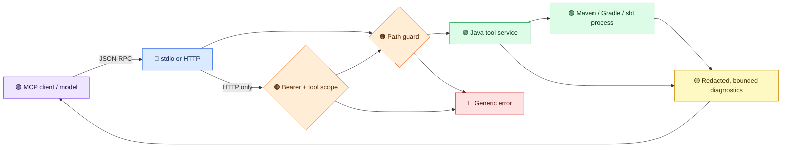

# Design review for 2.0

This page records the architecture decision for the 2.0 development line. The proposed first prerelease is `v2.0.0-rc.1`: the new required project roots, default HTTP authentication, removed model-visible tools, narrowed result shape, and scope semantics break 1.x clients. The Maven project remains `2.0.0-SNAPSHOT` until release gates pass.

## Trust boundaries

The `ToolCallbackProvider` is the shared boundary for stdio and HTTP. Only tools explicitly mapped to a public permission are exposed; future `@Tool` methods are private by default. It canonicalizes `projectDir` and `localRepositoryPath`, rejects build files whose real paths escape the configured roots, and applies the output policy. Raw resource readers, URI-template tools, and free-form CI generation remain private until they have useful privacy-safe result contracts. HTTP adds bearer and per-tool scope checks before dispatch. The catalog is static, so wrappers and credential digests are cached. Input schema failures abort startup and SDK input validation is enabled.

The public tool descriptions state the result contract after the output policy, rather than the richer local Java return values. In particular:

| Tool | Model-visible result | Retained locally |
|---|---|---|
| `analyze_pom_dependencies` | Dependency, managed-dependency, and imported-BOM counts | Coordinates and per-dependency classifications |
| `scan_dependency_cves` | Scanned, vulnerable, critical, and high counts; bounded redacted warnings | Dependency and CVE identities |

These aggregate results support triage but cannot identify a particular dependency to edit. A user who needs that detail must inspect the local build report outside the MCP result channel. The tool metadata and protocol tests pin this contract so a future implementation cannot advertise details that the model never receives.

## Critical review

| Finding from 1.x | 2.0 decision | Remaining risk |
|---|---|---|
| A built-in development key could authenticate HTTP | Remove it; HTTP defaults to bearer enforcement and keys default to no scopes | Operators must provision a key locally |
| Scope enum omitted live tools and was not enforced on calls | Publish only the 24 explicitly scoped tools; fail CI on catalog drift; check scope on HTTP `tools/call` | stdio relies on local process trust |
| Schema parse failure became an empty schema | Abort startup; validate tool inputs | Schema compatibility needs client conformance tests |
| Arbitrary build output and exceptions could reach the model | Bound and redact diagnostics, including quoted secrets and paths with spaces; return generic errors | Pattern redaction cannot detect all personal data or prompt injection |
| A stored build plan could be executed by ID without a path on the call | Withhold `create_build_plan` and `execute_build_plan` from MCP | Plan ownership and cancellation need a later design |
| Tool metadata, docs, and registry disagreed | Registry and quickstart describe the 24 exposed tools | Generate public catalog docs from code before stable release |
| Project detection could silently fall back to Maven | Treat markerless or ambiguous directories as an explicit error | Hybrid projects must specify a tool name |

A configured root is a filesystem boundary, not a sandbox. The canonical path check prevents common traversal and symlink escape, but a build script can execute programs, reach the network, and mutate files accessible to its process. A hostile workspace therefore needs OS or container isolation. Likewise, client prompts and tool arguments travel through the client/model provider before reaching this server. Relative aliases avoid sending an absolute home path; the server cannot guarantee that a client or user never sends private prompt text.

## Protocol contract

The runtime uses [MCP Java SDK 2.0.0](https://github.com/modelcontextprotocol/java-sdk/blob/main/VERSIONING.md), whose documented spec line is `2025-11-25`. The HTTP profile registers the SDK's stateless servlet on `/mcp`; its packaged-jar smoke and automated integration tests exercise `initialize`, `tools/list`, and `tools/call`. Discovery advertises that revision only. The 2026 draft `server/discover` handler is an inactive compatibility experiment; `/mcp/discover` remains an informational probe. A stable release still needs a real MCP client/inspector conformance pass over both transports.

## Performance budget

The hot path parses each tool argument once, checks canonical paths, runs the tool, then redacts a bounded result. The output policy limits parsing to the final 256,000 characters of a large result. The static callback array is built once; credential hashes are computed when keys load and incoming tokens use constant-time digest comparison. Build processes dominate latency, so subprocess output caps, timeout behavior, and cancellation matter more than micro-optimizing callback dispatch. Measure p50/p95 tool overhead and heap usage with synthetic projects before stable release; record baselines rather than claiming speedups from source inspection.

## Container isolation

The Docker image builds with a persistent BuildKit Maven cache, verifies Gradle and sbt archive checksums, excludes local secrets from the build context, and runs as a nonroot user. For adversarial tests, copy source into a disposable writable container workspace, mount the local Maven repository read-only, disable the network, and set CPU, memory, process, and time limits. Keep the Docker socket and host secret directories outside the container. A read-only Maven cache may need a disposable writable copy when dependencies are missing; do not mount the host cache writable for untrusted builds.

Build the image with `DOCKER_BUILDKIT=1 docker build -t jvm-build-tools:2.0-local .`, then run `./scripts/docker-verify.sh`. The helper copies the checkout into tmpfs, mounts `~/.m2/repository` read-only, runs Maven offline, and discards the container on exit.

## Review and release gates

Each change gets a focused test, a full `mvn -B verify`, then an adversarial review and an independent code-quality review from fresh checkouts. Both reviews leave inline PR findings and explicit verdicts. Every finding receives a fix or a written rationale, and CI reruns after changes. Run a privacy canary (synthetic email, path, and token) through both transports, exercise path traversal and scope denial, run a Docker clean-room verify, and build docs strictly before the prerelease. No 2.0 tag should be created while a gate is red or unverified.
