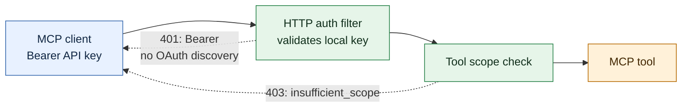
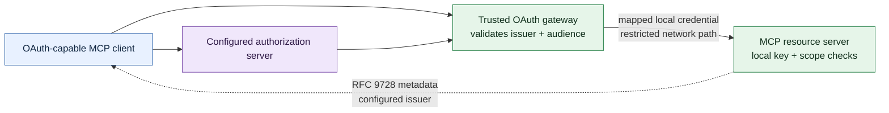

# HTTP authentication in 2.0

The HTTP profile binds to loopback and requires a configured, scoped **opaque API key** by default. Send it in the `Authorization: Bearer` header on each MCP request. Configure the key through the server environment; never put it in a prompt, URL, or repository. The default 401 challenge is `WWW-Authenticate: Bearer`. It does not claim that an OAuth authorization server exists.

Set `BUILDTOOLS_API_KEY_<NAME>` and `BUILDTOOLS_API_KEY_<NAME>_SCOPES` before starting the HTTP server. An empty scope list grants no public tool calls. The server compares locally configured key digests and checks each tool's scope. The 401 response never echoes a submitted key.

## Optional OAuth discovery

Set `buildtools.oauth.authorization-servers` to one or more issuer URLs only when your deployment has an authorization server and an **independent token-validation path**. With an issuer configured and bearer enforcement enabled, `GET /.well-known/oauth-protected-resource` returns RFC 9728 metadata including `authorization_servers`, and 401 challenges include its `resource_metadata` URL. Without an issuer or with enforcement disabled, that endpoint returns 404.

**Issuer configuration alone does not make this application an OAuth token validator.** The built-in filter still accepts only locally configured opaque keys; it does not fetch JWKS, validate JWT signatures, check issuer or audience claims, or introspect remote tokens. A gateway that validates issuer-issued tokens must be deployed so that clients cannot bypass it. It must securely map the verified identity and scopes to a locally recognized credential before forwarding to this server; a JWT forwarded unchanged will receive 401. Do not advertise an issuer until that end-to-end path has been tested.

Behind a TLS-terminating proxy, set `buildtools.oauth.resource` to the external canonical URL, such as `https://mcp.example.com/mcp`. The 401 challenge then links to `https://mcp.example.com/.well-known/oauth-protected-resource`, not the internal listener. If the public MCP endpoint has a path prefix, the proxy must still route this root well-known path to the server. The configured resource and issuer URLs must be absolute HTTPS URLs, except loopback HTTP for local development; user information, query strings, and fragments are rejected at startup. The server does not trust client-supplied forwarding headers to form OAuth discovery URLs.

This is a deployment integration point, not full MCP OAuth conformance. The [MCP 2025-11-25 authorization specification](https://modelcontextprotocol.io/specification/2025-11-25/basic/authorization) requires an advertised authorization server and audience-bound token validation for an OAuth protected resource. The default local-key mode intentionally makes neither claim.
