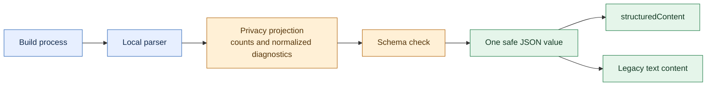

# Structured build analysis results

`analyze_build_output` returns a JSON object in MCP `structuredContent`. Its `tools/list` entry advertises an `outputSchema` that clients can use to validate the result. The existing `content[0].text` still contains the same serialized JSON for clients that only read text.

The result reports `completed: true` for a finished tool call. A build failure sets `success: false` and `isError: true`; a failure before build execution returns `completed: true`, `isError: true`, and a fixed privacy-safe `details` message. Optional fields include `errorCount`, `warningCount`, `testSummary`, and up to 12 `diagnostics`. A diagnostic can carry a category, severity, stable reference, file type, line, and normalized message. `fileRef` distinguishes files within one result without revealing names or paths. `diagnosticsTruncated` and `testSummary.countsCapped` make incomplete aggregates explicit.

For example, a synthetic compilation failure can produce:

```json
{
  "completed": true,
  "success": false,
  "isError": true,
  "errorCount": 1,
  "diagnostics": [{
    "severity": "error",
    "category": "compilation",
    "diagnosticRef": "d1",
    "fileRef": "f1",
    "fileType": "java",
    "line": 42,
    "message": "cannot find symbol: class [redacted-symbol]"
  }]
}
```

The server forms both MCP result fields from the same result after the shared model-output privacy policy removes raw logs, source symbols, credentials, email addresses, and absolute paths. The adapter checks the advertised schema before sending structured analysis; an out-of-contract result becomes a generic error. This contract is shared by the stdio and HTTP transports.



The result is designed for triage. Inspect files and local build reports through your normal trusted workflow before making source edits. Clients should treat all tool data as untrusted and must not treat diagnostic messages as instructions.
