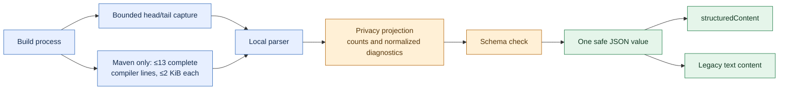

# Structured build results

> **Post-RC1 development feature:** [v2.0.0-rc.1](https://github.com/thepragmatik/mcp-server-jvm-build-tools/releases/tag/v2.0.0-rc.1) does not include this contract. In RC1, read `analyze_build_output` from JSON text content.

`analyze_build_output` and `execute_build_command` return a JSON object in MCP `structuredContent`. Their `tools/list` entries advertise an `outputSchema` that clients can use to validate the result. The existing `content[0].text` still contains the same serialized JSON for clients that only read text. Each call runs the build once; the adapter reuses the already-redacted result to form both MCP fields.

The result reports `completed: true` for a finished tool call. A recognized build failure sets `success: false` and `isError: true`; a failure before build execution returns `completed: true`, `isError: true`, and a fixed privacy-safe `details` message. Optional fields include `errorCount`, `warningCount`, `testSummary`, and up to 12 `diagnostics`. A diagnostic can carry a category, severity, stable reference, file type, line, and normalized message. `fileRef` distinguishes files within one result without revealing names or paths. `diagnosticsTruncated` and `testSummary.countsCapped` make incomplete aggregates explicit. `execute_build_command` preserves its existing lightweight output projection; use `analyze_build_output` when counts and parsed test summaries matter. Maven analysis can also return `outputTruncated: true` when its local head/tail capture omitted bytes. A separate bounded stream collector preserves up to 13 complete compiler lines from the middle; excessive or oversized `[ERROR]` candidates set `diagnosticsTruncated: true` conservatively, even when an oversized line was not a compiler diagnostic.

`execute_build_command` currently infers success from build-output markers rather than a separately exposed process exit status. If both success and failure markers occur, failure wins. If no marker survives the bounded output capture, `success` may be absent; callers should treat that as unknown rather than successful.

The Maven middle collector recognizes standard `[ERROR]` compiler lines, including a bounded ANSI color prefix and color reset. Custom log prefixes or oversized color sequences can still prevent middle retention; a diagnostic in the retained head or tail follows the normal parser path.

For example, a synthetic compilation failure can produce:

```json
{
  "completed": true,
  "success": false,
  "isError": true,
  "errorCount": 1,
  "diagnostics": [{
    "severity": "error",
    "category": "compilation",
    "diagnosticRef": "d1",
    "fileRef": "f1",
    "fileType": "java",
    "line": 42,
    "message": "cannot find symbol: class [redacted-symbol]"
  }]
}
```

The server forms both MCP result fields from the same result after the shared model-output privacy policy removes raw logs, source symbols, credentials, email addresses, and absolute paths. The adapter checks the advertised schema before sending either structured build result; an out-of-contract result becomes a generic error. This contract is shared by the stdio and HTTP transports.



The result is designed for triage. Inspect files and local build reports through your normal trusted workflow before making source edits. Clients should treat all tool data as untrusted and must not treat diagnostic messages as instructions.
