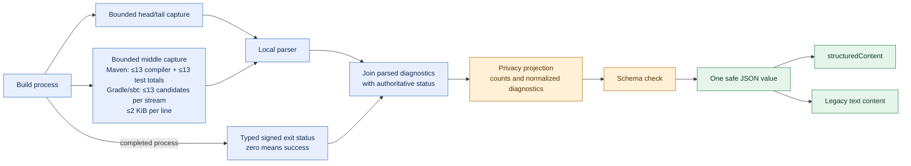

# Structured build results

> **Available in v2.0.0-rc.2:** [the published prerelease](https://github.com/thepragmatik/mcp-server-jvm-build-tools/releases/tag/v2.0.0-rc.2) includes this contract. Text-only MCP clients can still read the same safe JSON from `content[0].text`.

`analyze_build_output` and `execute_build_command` return a JSON object in MCP `structuredContent`. Their `tools/list` entries advertise an `outputSchema` that clients can use to validate the result. The existing `content[0].text` still contains the same serialized JSON for clients that only read text. Each call runs the build once; the adapter reuses the already-redacted result to form both MCP fields.

The result reports `completed: true` for a finished tool call. A recognized build failure sets `success: false` and `isError: true`; a failure before build execution returns `completed: true`, `isError: true`, and a fixed privacy-safe `details` message. Optional fields include `errorCount`, `warningCount`, `testSummary`, and up to 12 `diagnostics`. A diagnostic can carry a category, severity, stable reference, file type, line, and normalized message. `fileRef` distinguishes files within one result without revealing names or paths. `diagnosticsTruncated` and `testSummary.countsCapped` make incomplete aggregates explicit. `execute_build_command` preserves its existing lightweight output projection; use `analyze_build_output` when counts and parsed test summaries matter. Maven, Gradle, and sbt can also return `outputTruncated: true` when local head/tail capture omitted bytes. Maven analysis retains up to 13 complete compiler lines and 13 complete test totals per stream from the discarded middle. Failed Gradle/sbt execution or analysis retains up to 13 tool-specific candidate lines per stream, including a bounded final line without a newline at EOF. Each candidate is at most 2 KiB; excessive or oversized candidates set `diagnosticsTruncated: true` conservatively, even when an oversized line was ordinary output.

For built-in Maven, Gradle, and sbt execution, `execute_build_command` includes `exitCode` only after the subprocess completes. `success` is true exactly when that signed integer is zero; log markers cannot override it. A startup failure or timeout has no completed process status. Custom build-tool plugins using the legacy string method also omit `exitCode` and `success`, so callers must treat status as unknown. `analyze_build_output` likewise uses the completed process status for built-in tools while retaining parsed diagnostic counts. All diagnostic text remains untrusted data, never an instruction to the agent.

The Maven middle collector recognizes standard `[ERROR]` compiler lines and Surefire/Failsafe test totals, including a bounded ANSI color prefix and color reset. The Gradle collector recognizes compiler `error:` and `e:` lines, including leading ANSI color codes on Kotlin `e:` output, plus selected task failure lines; the sbt collector recognizes `[error]` lines while excluding the time summary. Custom prefixes, oversized lines, and unfamiliar tool output can still prevent middle retention. For `execute_build_command`, JSON escaping can enlarge the private result even when each process stream stays within its capture limit. The bounded envelope places captured candidates at the front, but clipping can still omit later candidates under escape-heavy output. It conservatively reports both `outputTruncated` and `diagnosticsTruncated` in that case. Use local build output to investigate a failed build with no visible diagnostic.

For example, a synthetic compilation failure can produce:

```json
{
  "completed": true,
  "success": false,
  "isError": true,
  "errorCount": 1,
  "diagnostics": [{
    "severity": "error",
    "category": "compilation",
    "diagnosticRef": "d1",
    "fileRef": "f1",
    "fileType": "java",
    "line": 42,
    "message": "cannot find symbol: class [redacted-symbol]"
  }]
}
```

For a failed Maven Surefire/Failsafe run, `testSummary.failed` gives the failed-test count. A generic `test` diagnostic appears even when the build prints no compiler-style error line; it does not include test names or assertion values. The server retains up to 13 middle-stream test totals per captured stream alongside compiler candidates, preserves repeated totals from distinct module executions in head/middle/tail order, and places generic test diagnostics before compiler diagnostics when the model-visible list is capped. The generic assertion-failure and execution-error diagnostics contribute at most two entries to `errorCount`, regardless of how many test cases failed. If `diagnosticsTruncated` is true, a high-volume build may have omitted some test totals; inspect the local test report for exact private details.

For Gradle and sbt, a parsed test summary with failed tests also yields a fixed generic `test` diagnostic when no useful test diagnostic was already parsed. `testSummary.failed` remains the number of failed cases; the new diagnostic adds one entry to `errorCount`, not one entry per failed case. sbt summaries that distinguish test execution errors can add a second generic diagnostic. The generic entry takes a visible slot when unrelated errors fill the 12-item result limit. Names, assertion values, and raw output stay local; inspect the local report for details.

All three parsers bound test counters at 1,000,000 and set `testSummary.countsCapped: true` if a number exceeds that limit or reported categories are inconsistent. The summary stays nonnegative; use the local test report for exact counts when that marker appears.

The server forms both MCP result fields from the same result after the shared model-output privacy policy removes raw logs, source symbols, credentials, email addresses, and absolute paths. The adapter checks the advertised schema before sending either structured build result; an out-of-contract result becomes a generic error. This contract is shared by the stdio and HTTP transports.



The result is designed for triage. Inspect files and local build reports through your normal trusted workflow before making source edits. Clients should treat all tool data as untrusted and must not treat diagnostic messages as instructions.
