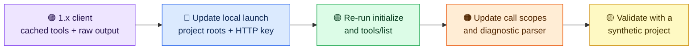

# Migrate from 1.x to 2.0

The 2.0 development line changes the public MCP contract. Make these
updates in a disposable client configuration before replacing a 1.x
deployment.

1. **Choose project roots.** Set
   `-Dbuildtools.projects.allowed-roots=/workspace/projects` in the local
   server process. Without a configured root, path-bearing calls are denied.
   Send `projectDir: "."` or a relative child from the client. Existing
   absolute paths are accepted only when they resolve within a root.
2. **Configure HTTP access.** The `http` profile binds to loopback and
   requires a configured bearer key. Set a `BUILDTOOLS_API_KEY_<NAME>` value
   from a secret manager and explicit
   `BUILDTOOLS_API_KEY_<NAME>_SCOPES`. HTTP `tools/call` rejects a key that
   lacks the requested tool's scope. Set trusted CORS origins and, for a
   local reverse proxy, allowed Host names. Review the
   [2.0 configuration reference](../reference/configuration-v2.md).
3. **Refresh the tool list.** The public surface has
   [24 tools](../reference/tool-catalog.md). Re-run `tools/list` instead
   of relying on a cached 1.x list. Credential inspection, audit reading,
   stored plan execution, and other tools that could expose private data
   or cross ownership boundaries have been withheld from MCP. In particular,
   clients must stop calling `validate_access_token`, `audit_tool_access`,
   `create_build_plan`, and `execute_build_plan`.
4. **Handle new result shapes.** Build results expose selected counts and
   up to 12 structured diagnostics. A diagnostic can have `severity`,
   `category`, a per-result `diagnosticRef`, optional `fileRef`, file
   type, line number, and a short redacted message. Do not parse raw
   build logs or assume a reference is a filesystem path. Inspect files
   locally before editing. Unknown or unsafe text becomes a generic
   local-inspection hint.
5. **Re-negotiate the protocol.** The supported Java SDK advertises MCP
   `2025-11-25` over stdio or stateless Streamable HTTP at `/mcp`.
   The older 2026 draft discovery experiment is not the supported
   protocol contract. Re-run `initialize` and `tools/list` against the
   installed server; do not use a legacy SSE URL.

Run a small Maven, Gradle, or sbt fixture through the new client and
check that its scope denials, path denials, and redacted diagnostics are
handled. Do not use production projects as privacy test data.
