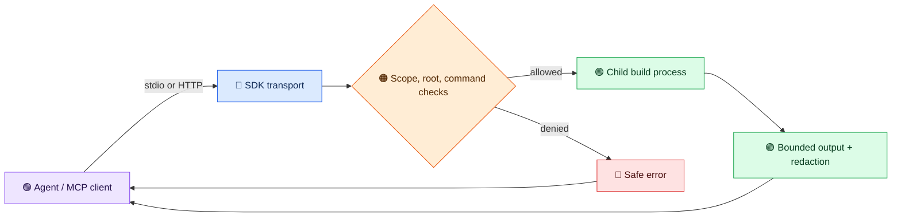

# Overview

`mcp-server-jvm-build-tools` lets an MCP client detect, run, and inspect Maven, Gradle, and sbt builds. The current 2.0 release-candidate contract exposes [24 public tools](../reference/tool-catalog.md) through stdio or optional Streamable HTTP using MCP `2025-11-25`.

A client can discover a project's build tool, validate supported build files, run allowed commands, inspect bounded test and compiler diagnostics, and query dependency versions. Call `tools/list` for the exact input schemas in the installed JAR.

## A first useful session

1. Follow the [quickstart](quickstart-v2.md): configure an existing allowed project root and launch the packaged server.
2. Ask the client to call `detect_build_tool` with `{"projectDir":"."}`. The alias selects the first configured root without placing an absolute host path in a model-visible argument.
3. Ask for `list_build_tools` or run a supported test command with `execute_build_command`. The server returns a bounded result with structured, redacted diagnostics. Raw build logs and process commands remain local.

For existing clients, read [migration to 2.0](migration-v2.md) before upgrading. For each tool's scope and schema, use the [current catalog](../reference/tool-catalog.md).

## Where the boundaries are

Project roots and command checks constrain requests; they do **not** sandbox a build script. A build process inherits the server's OS permissions and may run other programs, access files, or use the network. Use [container isolation](../reference/design-v2.md#container-isolation) for untrusted projects. The default stdio transport opens no listening port, but dependency lookups and build scripts may use network access. HTTP is opt-in and requires a configured bearer key and per-tool scopes.

See the [architecture reference](../reference/architecture.md) for component details and the [configuration guide](configuration.md) for local and HTTP setup.
