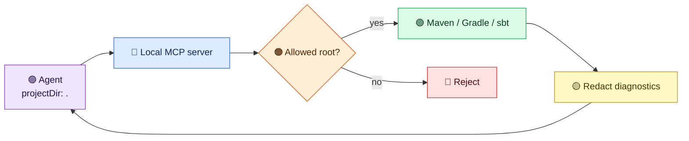

# Quickstart for 2.0

Build with Java 21+ and `./mvnw -B verify --no-transfer-progress`.
The server exposes [24 public tools](../reference/tool-catalog.md); use `tools/list` for the exact input schema of your installed version.

## Stdio in three steps

1. Set `buildtools.projects.allowed-roots` to an existing directory in the server's local process configuration.
2. Launch the jar from an MCP client with stdin/stdout attached:

```sh
java -Dbuildtools.projects.allowed-roots=/workspace/projects -jar target/mcp-server-jvm-build-tools.jar
```

3. Call `detect_build_tool` with `{"projectDir":"."}`. A relative path such as `"service-a"` selects a child of the first allowed root. Absolute home paths stay out of the conversation.

For HTTP, set `BUILDTOOLS_API_KEY_LOCAL` from a secret store and `BUILDTOOLS_API_KEY_LOCAL_SCOPES=build:read,dependency:read`. Add `build:execute` only when builds are needed. Start the jar with `--spring.profiles.active=http`. It binds to `127.0.0.1:8080` and accepts MCP at `/mcp` with an `Authorization: Bearer` header. A wider bind requires project roots, a configured key, bearer enforcement, and restricted CORS.

Maven `deploy` and sbt `publish` are unavailable through `build:execute`;
local install and publish tasks remain available. Build scripts can still have
side effects and inherit the server's credentials. Isolate untrusted projects
without credentials or network access.



Results contain aggregate counts and up to 12 structured diagnostics, with errors before warnings. Each diagnostic has `severity`, `category`, a per-result `diagnosticRef`, optional per-result `fileRef`, file type and positive line number, and a bounded redacted message. For example, a compiler error can return `{"severity":"error","category":"compilation","fileRef":"f1","fileType":"java","line":42,"message":"cannot find symbol: [redacted-symbol]","diagnosticRef":"d1"}`. The references distinguish diagnostics and group messages from one file without revealing its path; inspect local build output to identify that file and symbol before editing. Unknown or unsafe text gets a generic local-inspection hint. Raw paths, source excerpts, commands, dependency identities, symbols, and logs are withheld. Build scripts can run other programs and make network calls, so use the [container workflow](../reference/design-v2.md#container-isolation) for untrusted projects.

In builds after `v2.0.0-rc.1`, `analyze_build_output` clients can read this safe result directly from MCP
`structuredContent` and validate it with the advertised `outputSchema`. Text-only
clients, including RC1, receive JSON in `content[0].text`. See the
[structured-result reference](../reference/structured-build-results.md) for the
exact fields and a synthetic example.
