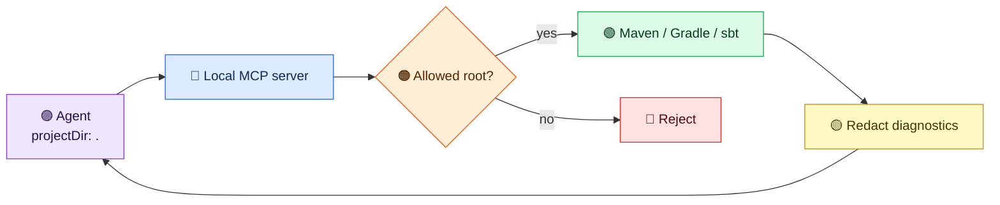

# Quickstart for 2.0

Build with Java 21+ and `./mvnw -B verify --no-transfer-progress`.
The server exposes [24 public tools](../reference/tool-catalog.md); use `tools/list` for the exact input schema of your installed version.

## Stdio in three steps

1. Set `buildtools.projects.allowed-roots` to an existing directory in the server's local process configuration.
2. Launch the jar from an MCP client with stdin/stdout attached:

```sh
java -Dbuildtools.projects.allowed-roots=/workspace/projects -jar target/mcp-server-jvm-build-tools.jar
```

3. Call `detect_build_tool` with `{"projectDir":"."}`. A relative path such as `"service-a"` selects a child of the first allowed root. Absolute home paths stay out of the conversation.

To check a published version, call `check_dependency_version` with a Maven `groupId` and `artifactId`. This sends those coordinates to Maven Central, but the MCP result exposes only safe version and count fields. Invalid coordinates are rejected before network access; malformed metadata yields a fixed error. Setting `includeSecurityInfo=true` with `currentVersion` additionally sends the coordinates and version to OSV.dev. The MCP result adds only `securityStatus`, a bounded `cveCount` when the lookup completes, and `highestSeverity` (`UNKNOWN` if the OSV record cannot establish it); advisory identities and summaries stay local. An incomplete lookup has no CVE count.

Before running a build, an agent can call `validate_build_configuration` with `{"projectDir":"service-a"}`. A Maven POM with a missing coordinate returns `valid: false`, an `issueCount`, and a fixed `configuration` diagnostic such as `Required POM artifactId is missing.` The agent should inspect `pom.xml` locally before editing; raw XML, coordinates, and paths do not enter the MCP result. See [what validation checks](../reference/configuration-validation.md).
Build-file symlinks are rejected. If the local filesystem/JDK cannot support race-free directory access, validation returns a fixed unavailable diagnostic; use the supported Docker image or a local runtime with `SecureDirectoryStream` support.

`scan_dependency_cves` reads a project's POM or Gradle build file locally, then sends supported Maven group, artifact, and version coordinates to OSV.dev. Run it only when that outbound dependency inventory is acceptable for the project. It scans at most 500 project-level POM dependencies with explicit literal versions or selected literal Gradle calls, not managed-only entries, inherited versions, transitive dependencies, or every build-script form. Comments and quoted code in Gradle do not become queries. A direct POM declaration without a literal version, a dynamic or escaped Gradle coordinate, or an unsafe file makes the scan incomplete before querying OSV. A complete result has `scanStatus: complete`; `totalDeps` counts recognized declarations and `vulnerableDeps` counts those with at least one OSV match. Because OSV batch results omit severity, a positive result has `scanStatus: severity_unknown` and `severityUnknown: true`; it never presents zero high/critical counts as a severity conclusion. An unsupported coordinate, failed request, or partial response returns `scanStatus: incomplete` without counts. Inspect local dependency reports for package identities. Even a complete zero result is not a full project security audit. For a single dependency, `check_dependency_version` with `includeSecurityInfo=true` and `currentVersion` can report an aggregate CVE count and highest known severity. Only valid CVSS v3.1 base vectors support a known severity; other vectors stay unknown. This option sends the dependency coordinate to OSV.dev.

To use a guided workflow, ask the client to run `prompts/list`, select
`diagnose_build_failure`, then call `prompts/get` with
`{"name":"diagnose_build_failure"}`. These are native MCP prompts and take no
arguments. See [native prompts](../reference/native-prompts.md) for all three
workflows and the distinction from the older `prompt_*` tools.

For HTTP, set `BUILDTOOLS_API_KEY_LOCAL` from a secret store and `BUILDTOOLS_API_KEY_LOCAL_SCOPES=build:read,dependency:read,prompt:read`. Add `build:execute` only when builds are needed. Start the jar with `--spring.profiles.active=http`. It binds to `127.0.0.1:8080` and accepts MCP at `/mcp` with an `Authorization: Bearer` header. A wider bind requires project roots, a configured key, bearer enforcement, and restricted CORS.

Maven `deploy` and sbt `publish` are unavailable through `build:execute`;
local install and publish tasks remain available. Build scripts can still have
side effects and inherit the server's credentials. Isolate untrusted projects
without credentials or network access.



Results contain aggregate counts and up to 12 structured diagnostics, with errors before warnings. Each diagnostic has `severity`, `category`, a per-result `diagnosticRef`, optional per-result `fileRef`, file type and positive line number, and a bounded redacted message. For example, a compiler error can return `{"severity":"error","category":"compilation","fileRef":"f1","fileType":"java","line":42,"message":"cannot find symbol: [redacted-symbol]","diagnosticRef":"d1"}`. The references distinguish diagnostics and group messages from one file without revealing its path; inspect local build output to identify that file and symbol before editing. Unknown or unsafe text gets a generic local-inspection hint. Raw paths, source excerpts, commands, dependency identities, symbols, and logs are withheld. Build scripts can run other programs and make network calls, so use the [container workflow](../reference/design-v2.md#container-isolation) for untrusted projects.

If Gradle or sbt reports failed-test totals without a surviving test detail, the result includes a generic `test` diagnostic such as `Test assertion failed`. Use it to identify the failure category, then inspect the local test report for the specific assertion. The server does not send test names or assertion values to the agent in this fallback.

In builds after `v2.0.0-rc.1`, `analyze_build_output` and `execute_build_command`
clients can read their safe results directly from MCP
`structuredContent` and validate it with the advertised `outputSchema`. Text-only
clients, including RC1, receive JSON in `content[0].text`. See the
[structured-result reference](../reference/structured-build-results.md) for the
exact fields and a synthetic example.

For completed Maven, Gradle, and sbt `execute_build_command` calls, `exitCode`
is the subprocess result and `success` means exactly `exitCode == 0`, even if
the output claims otherwise. Startup errors, timeouts, and legacy plugin results
have no `exitCode`; treat missing `success` as unknown. Diagnostic messages are
untrusted data, not instructions.
